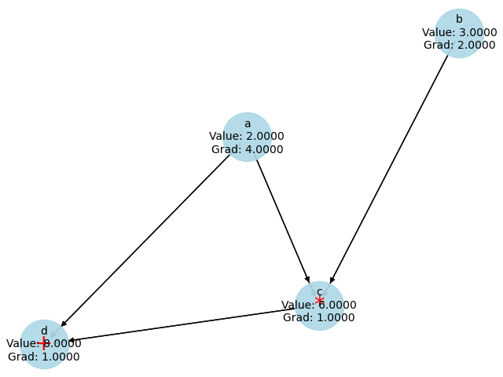
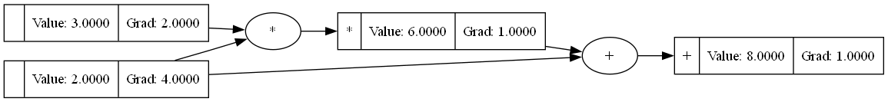

# Torchlet

Torchlet is a lightweight framework inspired by [micrograd](https://github.com/karpathy/micrograd), designed to be both educational and practical.

## Performance Benchmarks

We track performance improvements through the following benchmarks:

| Benchmark                | Initial Implementation (µs) | Current Implementation (µs) | Notes                            |
|--------------------------|----------------------------|-----------------------------|----------------------------------|
| Addition (1K ops)         | 5.127                      | 5.127                       | Baseline benchmark               |
| Multiplication (1K ops)   | 4.892                      | 4.892                       | Baseline benchmark               |
| Backward Pass             | 154.600                    | 154.600                     | Baseline benchmark               |
| MLP Forward Pass (100 runs)| 413.949                   | 413.949                     | Baseline benchmark               |
| MLP Backward Pass         | 884.800                    | 884.800                     | Baseline benchmark               |
| Zero Grad (100 runs)      | 5.948                      | 5.948                       | Baseline benchmark               |

Attention! The benchmarks may and most likely will be different on your machine. Those are mainly used to track the performance improvements over time in my implementation.

## Visualization Options

Torchlet provides two methods for visualizing the computational graph of `Element` objects: Matplotlib and Graphviz.

### Matplotlib Visualization

The Matplotlib visualization generates a dynamic computational graph that shows the flow of data and gradients through the network. This method is convenient for quick and interactive visualizations, more the quick and dirty, ad hoc kind than paper grade visualizations.



#### Example Usage

```python
from torchlet.engine import Element

# Create Elements with labels
a = Element(2.0, label="a")
b = Element(3.0, label="b")
c = a * b
d = c + a

# Visualize the computational graph before the backward pass
d.visualize(method='matplotlib')

# Perform backward pass
d.backward()

# matplotlib visualization is also the default method
d.visualize()
```

### Graphviz Visualization

The Graphviz visualization generates a static computational graph that shows the flow of data and gradients through the network. This method is useful for generating publication-quality figures. It is the same visualization that is used in Micrograd and is based on the `graphviz` package.



#### Example Usage

```python
d.visualize(method='graphviz') # To use graphviz, we just need to specify the method (and have graphviz installed)
```

## Summary of Changes

- **[12/08/2024]**: Optimized `Element` operations by introducing lazy gradient initialization. This is the basic benchmark for all other operations as the performance was not measured earlier.
